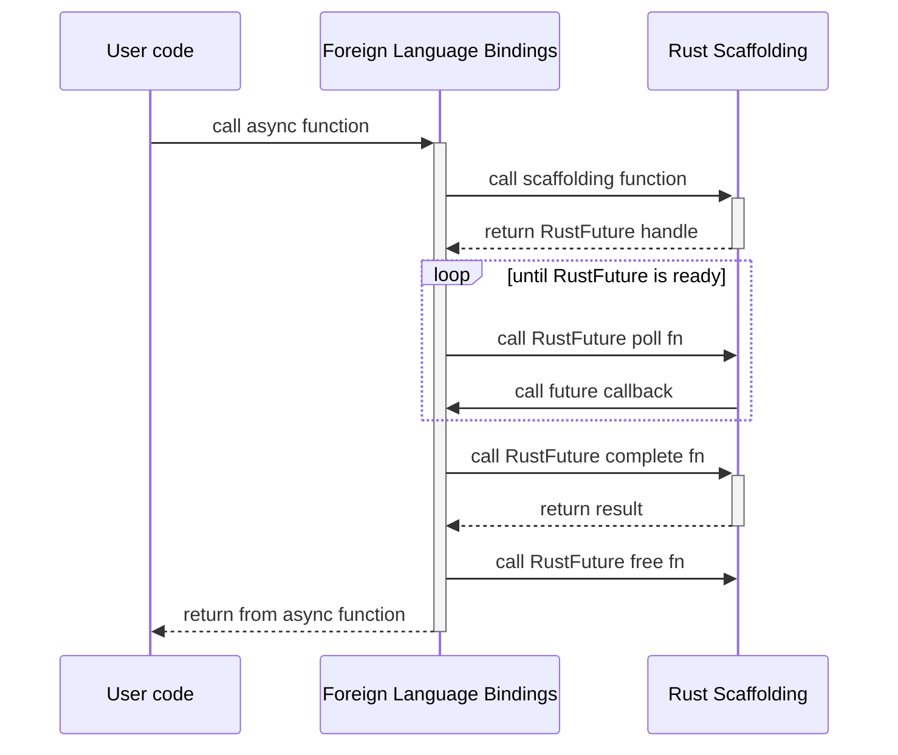
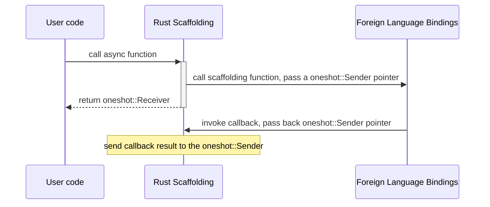
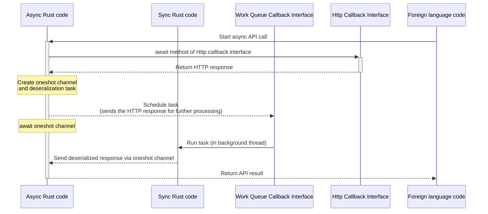

# UniFFI Async Overview

This document describes how UniFFI implements async from a high-level.
Once you've read this, you can also check out the low-level [Async FFI details](async-ffi.md).

## What runtime does async code run on?

The fundamental issue here is that UniFFI can't rely on a Rust async runtime.
We don't want to force library authors into a particular runtime.
Furthermore, we want to allow library authors to not use a runtime at all and instead to integrate with the runtime of the application using the library.

To accomplish this, UniFFI piggybacks off the runtime from the foreign bindings.
The generated Rust code schedules work using callbacks provided by the foreign bindings.

## Rust Async functions

Rust async functions are implemented by wrapping the
[Future](https://doc.rust-lang.org/std/future/trait.Future.html) into a `uniffi::RustFuture` struct
and providing scaffolding functions so that the foreign bindings can drive the future to completion.

For each async function, UniFFI generates 4 scaffolding functions:
* A scaffolding function that returns a `RustFuture` handle
* `rust_future_poll` to poll the future
* `rust_future_complete` to receive the completed result of a future
* `rust_future_free` to destroy a future freeing any underlying memory
* Technically, the function names are more like `uniffi_[module_prefix]_rust_future_poll`, but this document uses above names make for shorthand.

The UniFFI generated code for an async function performs these steps:

1. Call the Rust scaffolding function, receiving a `RustFuture` handle
1. Call the `rust_future_poll` function for the future until the future is ready.
   * The `rust_future_poll` function inputs a callback function and an opaque pointer (AKA a `void *`) to call the callback with.
   * If the future is pending, then the generated code registers a waker that will call the callback function with `RUST_FUTURE_MAYBE_READY`.
     When the generated foreign code sees this, it calls poll again, starting the loop over.
   * If the future is ready, then the callback function is immediately called with `RUST_FUTURE_READY` and we move to the next step.
1. Call `rust_future_complete`, receiving the return value of the future
1. Call `rust_future_free` (ideally in a `finally` block)
1. Return the result from `rust_future_complete`

### Why not have `rust_future_poll` return a boolean?

As described above, `rust_future_poll` inputs a callback and an opaque pointer.
If the future is ready, then `rust_future_poll` immediately invokes the callback, passing it the pointer back and `RUST_FUTURE_READY`
A more straightforward API would be to return a boolean if the future is ready, why not do that?

The issue is that it doesn't work well with the way foreign code's lifetime management.
The opaque pointer is usually either something like a raw `Arc` pointer that holds data about the async call.
When the foreign code passes the pointer to `rust_future_poll`, it temporarily [leaks a reference](https://doc.rust-lang.org/std/sync/struct.Arc.html#method.into_raw).
Then when callback is called, it [reconstructs the leaked reference](https://doc.rust-lang.org/std/sync/struct.Arc.html#method.from_raw), restoring the refcount.

If `rust_future_poll` returned `true` to indicate that the future is ready, then the foreign code is in an awkward situation.
It wants to use the async call data that the pointer was referring to, but it just sent a leaked pointer to Rust.
It would have to hold on to a copy of the raw pointer, use that to restore the reference, and assume the callback is never going to be called.
This could work, but it makes things much more complicated and could easily lead to memory leaks or use-after-free bugs.

## Foreign async callback methods

Async callback/trait interface methods are the way that Rust makes async calls across the FFI.
These are implemented using a callback, which makes them quite a bit simpler than their counterparts.

The UniFFI generated code for an async trait method performs these steps:

  - Create a `oneshot::Channel` (see [oneshot crate](https://docs.rs/oneshot/latest/oneshot/) for how these work, although we don't currently depend on that crate).
  - Leak the `oneshot::Sender` into a raw pointer
  - Defines an `extern "C"` function that will:
      - input that raw pointer plus a return value 
      - lift the return value
      - send the return value into the `oneshot::Sender`.
  - Call the callback method, passing a pointer to the function from the last step and the `oneshot::Sender` raw pointer.
  - Return the receiver half of the `oneshot::Channel`.

On the foreign side, the generated code simply runs the async function as normal, and call the callback once it completes.

## Can you really just piggyback on the foreign async runtime?

It's somewhat surprising, but yes.
All the async code can run in the foreign runtime and Rust never has to start its own eventloop thread.
In order to implement this, the Rust async functions must only await functions that fall into one of these categories:

* UniFFI async callback/trait methods
  This often means defining traits for things like HTTP clients so that Rust can leverage async HTTP libraries from the foreign side.
* Async functions from crates like [oneshot](https://docs.rs/oneshot/latest/oneshot/) and [async_mutex](https://docs.rs/async-mutex/latest/async_mutex/) that work with any runtime.

Beware that some Rust crates will present async APIs that silently start up runtimes in the background.
For example, [reqwest](https://docs.rs/reqwest/latest/reqwest/) will start a tokio runtime.

The [Async API client example](https://github.com/mozilla/uniffi-rs/tree/main/examples/async-api-client) shows how this could work in the real-world.
The Rust library depends an async HTTP callback interface to do the low-level fetching, then deserializes/validates the HTTP response.
After that, it returns a high-level API response struct to the application.
Furthermore, let's stipulate that the deserialization/validation is slow enough to be considered blocking.
To manage this, the Rust library also depends on a (synchronous) callback interface that runs a task in a worker queue where blocking is allowed.
Here's how the async API call could be handled:

* Action in this sequence diagram represents calling an async Rust function or async callback interface method, see the above diagrams for details.
* The dotted lines show how the data is passed around during the async call.
* The async Rust code runs in a [Future::poll](https://doc.rust-lang.org/std/future/trait.Future.html#tymethod.poll) method, inside the foreign event loop.  This code never blocks.
* The sync Rust code runs inside a worker queue where it's okay to block.
* This all combines together to create an async Rust call that's driven by the foreign event loop.

## Can you integrate with Rust Runtimes like `tokio`?

Yes.  This will vary for each runtime, but the typical procedure is:

- Keep a reference to the runtime
- Use a bridge function like [tokio::Runtime::spawn](https://docs.rs/tokio/latest/tokio/runtime/struct.Runtime.html#method.spawn) to await a future that runs in that runtime.

There's also the `uniffi::async_runtime` macro attribute to help with this, but it's not clear if we
want to continue to support it ([#1726](https://github.com/mozilla/uniffi-rs/issues/1726)).
