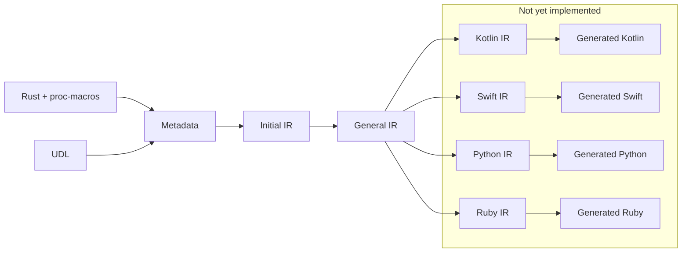

# The UniFFI Bindings IR

**Note:** the Bindings IR is currently an experiment.
It's checked in so that we can use it for the gecko-js external binding generator.
Our current recommendation for other external bindings authors is to avoid using it for now since we haven't fully committed to this new system and expect it to change.

UniFFI models foreign bindings generation as a compiler pipeline:




1. Metadata is generated from the proc-macro code and UDL files.
   The metadata is a simple reflection of the Rust definitions.
2. The initial IR is built from the metadata with very few transformations.
3. The initial IR is transformed into the general IR.
   This adds information like FFI function names, that's needed for bindings generation.
4. The general IR is transformed into a language-specific IR.
   This adds information like concrete type names.
5. The final step uses the language-specific IR and to generate the bindings code.

This document describes the system from a high-level.
See [Bindings IR Pipeline](./bindings_ir_pipeline.md) for details on how the IR pipeline is implemented.

## Generation

When a UniFFI proc-macro wraps a Rust item, it records metadata about the item it's wrapping.
For example, when `#[uniffi::export]` wraps a function, it records the function name, arguments, return type, etc.
This metadata is then serialized into a buffer and stored as an exported symbol in the Rust library.
The generated code will look something like this:

```rust
// An example exported Rust function
#[uniffi::export]
fn add(a: u64, b: u64) -> Result<u64> {
    a.checked_add(b)
        .ok_or(ArithmeticError::IntegerOverflow { a, b })
}

// Metadata buffer for `arithmetic::add()`, generated by the `uniffi::export` macro.
const UNIFFI_META_CONST_ARITHMETIC_FUNC_ADD: ::uniffi::MetadataBuffer = ::uniffi::MetadataBuffer::from_code(
        ::uniffi::metadata::codes::FUNC, // Code for the item type
    )
    .concat_str("arithmetic") // module name
    .concat_str("add") // function name
    .concat_bool(false) // async?
    .concat_value(2u8) // number of arguments
    .concat_str("a") // 1st argument name
    .concat(<u64 as ::uniffi::TypeId<crate::UniFfiTag>>::TYPE_ID_META) // 1st argument type
    .concat_bool(false) // default value?
    .concat_str("b") // 2nd argument name
    .concat(<u64 as ::uniffi::TypeId<crate::UniFfiTag>>::TYPE_ID_META) // 2nd argument type
    .concat_bool(false) // default value?
    .concat(<Result<u64> as ::uniffi::TypeId<crate::UniFfiTag>>::TYPE_ID_META) // result type
    .concat_long_str(""); // docstring

// Serialize the metadata into a byte array and export the symbol.
// This can be evaluated at compile time because `UNIFFI_META_ARITHMETIC_FUNC_ADD` is `const`.
#[no_mangle]
#[doc(hidden)]
pub static UNIFFI_META_ARITHMETIC_FUNC_ADD: [u8; UNIFFI_META_CONST_ARITHMETIC_FUNC_ADD
    .size] = UNIFFI_META_CONST_ARITHMETIC_FUNC_ADD.into_array();
```

Notes:

* UniFFI gets the type metadata types using the `TypeId::TYPE_ID_META`.
  By using a trait and associated type rather than relying on the type identifier, we get the correct metadata even through type aliases.
  For example, `Result<u64>` is a type alias with the error type omitted, but `<Result<u64> as ::uniffi::TypeId<crate::UniFfiTag>>::TYPE_ID_META>` includes metadata about the error type.
* See [Lifting and Lowering](./lifting_and_lowering.md) for details on `UniFfiTag`.
* If a UDL file is present, UniFFI also generates metadata from that and merges it with the proc-macro metadata.

When a UniFFI bindgen command runs, it reads/deserializes the exported metadata symbols from the Rust library.
Then the metadata is passed on to the next stage of the pipeline
See `uniffi_bingen::macro_metadata` and `uniffi_meta::reader` for details.

Here's how the metadata might look for the above function:
```
FnMetadata {
    module_path: "arithmetic",
    name: "add",
    is_async: false,
    inputs: [
        FnParamMetadata {
            name: "a",
            ty: UInt64,
            by_ref: false,
            optional: false,
            default: None,
        },
        FnParamMetadata {
            name: "b",
            ty: UInt64,
            by_ref: false,
            optional: false,
            default: None,
        },
    ],
    return_type: Some(
        UInt64,
    ),
    throws: Some(
        Enum {
            module_path: "arithmetic",
            name: "ArithmeticError",
        },
    ),
    checksum: Some(
        39863,
    ),
    docstring: None,
},
```

## Metadata -> Initial IR

This phase transforms inputs the metadata and creates an IR from it.
The Initial IR contains the metadata items with a couple changes.
The main change is the flat list is converted into a tree structure.

```rust
/// Root node of the Initial IR
///
/// Note: The `Node` derive also implements `Default` and `Default` should not be listed in the
/// #[derive] list.
#[derive(Debug, Clone, Node)]
pub struct Root {
    pub modules: IndexMap<String, Module>,
    /// The library path the user passed to us, if we're in library mode
    pub cdylib: Option<String>,
}

#[derive(Debug, Clone, Node)]
pub struct Module {
    pub name: String,
    pub crate_name: String,
    pub docstring: Option<String>,
    pub functions: Vec<Function>,
    pub type_definitions: Vec<TypeDefinition>,
}

#[derive(Debug, Clone, Node)]
// This is just FnMetadata with a new struct name
#[node(from(FnMetadata))]
pub struct Function {
    pub name: String,
    pub is_async: bool,
    pub inputs: Vec<Argument>,
    pub return_type: Option<Type>,
    pub throws: Option<Type>,
    pub checksum: Option<u16>,
    pub docstring: Option<String>,
}

#[derive(Debug, Clone, Node)]
pub enum TypeDefinition {
    /// RecordMetadata with a new struct name
    /// This has `FieldMetadata` as child nodes
    Record(Record),
    /// RecordMetadata with a new struct name
    /// This has `VariantMetadata` as child nodes and `FieldMetadata` as grand children.
    Enum(Enum),
    /// ObjectMetadata with a new struct name
    /// This has child nodes for ConstructorMetadata, MethodMetadata, and several other metadata
    /// items.
    Interface(Interface),
    /// ...etc
    CallbackInterface(CallbackInterface),
    Custom(CustomType),
}
```

## Initial IR -> General IR

This phase adds derived information about the FFI.
Some examples are:

* The FFI scaffolding function for each Rust function
* The FFI scaffolding functions to clone/free object references
* The FFI type that each type is lowered into/lifted from
* If a type is used as an error or not


Here's how `Function` might look in the General IR.

```
Function {
    name: "add",
    ...
    arguments: [
        Argument {
            name: "a",
            ty: Type {
                kind: UInt64,
                ffi_type: FfiType::UInt64,
                ...
            },
            ...
        },
        ...
    ],
    return_type: ReturnType {
        ty: Some(
            Type {
                kind: UInt64,
                ffi_type: FfiType::UInt64,
                ...
            },
        ),
        ...
    },
    throws_type: ThrowsType {
        ty: Some(
            Type {
                kind: Enum {
                    module_path: "arithmeticpm",
                    name: "ArithmeticError",
                },
                ffi_type: FfiType::RustBuffer,
                ...
            },
        ),
        ...
    },
    ffi_func: FfiFunctionRef {
        name: "uniffi_arithmeticpm_fn_func_add",
        ...
    },
    ...
}
```

## General IR -> Language-specific IR

This phase transforms the general IR into a language-specific one:

* Language-specific data is added, like concrete type names and the names of the `FfiConverter` classes that lift/lower types
* New top-level items may be added, for example a list of import statements.
* Fields like `name` and `docstring` will be transformed to the preferred style for the language.

For example, when the function IR is specialized for Python:

* Concrete type names will be added
* The FFI converter class name is added
* Docstrings will be formatted as Python docstrings
* Names will usually stay the same, since Rust and Python happen to share the same naming style.
  Other languages may translate names into camelCase.

```
Function {
    name: "add",
    ...
    arguments: [
        Argument {
            name: "a",
            ty: Type {
                kind: UInt64,
                "type_name": String(
                    "int",
                ),
                "ffi_converter_name": String(
                    "_UniffiConverterUInt64",
                ),
                "ffi_type_name": String(
                    "ctypes.c_uint64",
                ),
                ...
            },
            ...
        },
        ...
    ],
    return_type: ReturnType {
        ty: Some(
            Type {
                kind: UInt64,
                "type_name": String(
                    "int",
                ),
                "ffi_converter_name": String(
                    "_UniffiConverterUInt64",
                ),
                "ffi_type_name": String(
                    "ctypes.c_uint64",
                ),
                ...
            },
        ),
        ...
    },
    throws_type: ThrowsType {
        ty: Some(
            Type {
                kind: Enum {
                    module_path: "arithmeticpm",
                    name: "ArithmeticError",
                },
                "type_name": String(
                    "ArithmeticError",
                ),
                "ffi_converter_name": String(
                    "_UniffiConverterTypeArithmeticError",
                ),
                "ffi_type_name": String(
                    "_UniffiRustBuffer",
                ),
                ...
            },
        ),
        ...
    },
    ffi_func: FfiFunctionRef {
        name: "uniffi_arithmeticpm_fn_func_add",
        ...
    },
    ...
},
```

## Language-specific IR -> Generated Bindings Code

The final phase takes the language-specific IR and uses it to generate the bindings code.
We use the [Askama](https://askama.readthedocs.io/en/stable/) template rendering engine for this.

In this phase, the top-level `add` function is implemented by:
  - checking/lowering all arguments using the class named by `Argument.ty.lang_data.ffi_converter_name`
  - calling the scaffolding function named by `ffi_func.name`
  - handling errors using the class named by `ReturnType.ty.lang_dataffi_converter_name`
  - lifting the return value using the class named by `ThrowsType.ty.lang_data.ffi_converter_name`

```python
def add(a: int, b: int) -> int:
    _UniffiConverterUInt64.check_lower(a)
    _UniffiConverterUInt64.check_lower(b)
    _uniffi_return = _uniffi_rust_call_with_error(
        _UniffiConverterTypeArithmeticError,
        _UniffiLib.uniffi_arithmeticpm_fn_func_add,
        _UniffiConverterUInt64.lower(a),
        _UniffiConverterUInt64.lower(b),
    )
    return _UniffiConverterUInt64.lift(_uniffi_return)
```

## How does this work under the hood?

See [Bindings IR Pipeline](./bindings_ir_pipeline.md) for details on how the IR pipeline is implemented.
