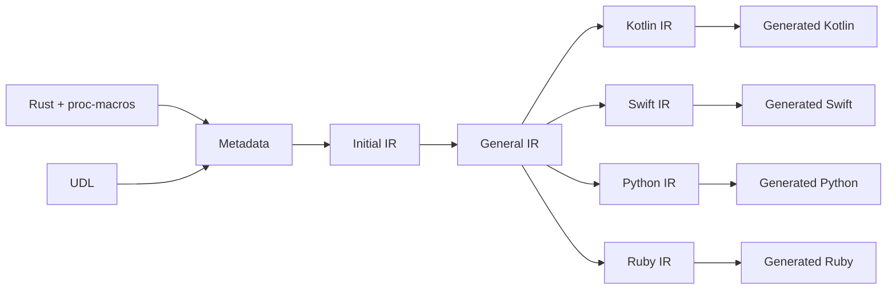

# The UniFFI Bindings IR

UniFFI models foreign bindings generation as a compiler pipeline:


```mermaid
flowchart LR
    ProcMacros[Rust + proc-macros] --> Metadata[Metadata]
    UDL[UDL] --> Metadata[Metadata]
    Metadata --> InitialIr[Initial IR]
    InitialIr --> GeneralIr[General IR]
    GeneralIr --> KotlinIr[Kotlin IR]
    GeneralIr --> SwiftIr[Swift IR]
    GeneralIr --> PythonIr[Python IR]
    GeneralIr --> RubyIr[Ruby IR]
    KotlinIr --> Kotlin[Generated Kotlin]
    SwiftIr --> Swift[Generated Swift]
    PythonIr --> Python[Generated Python]
    RubyIr --> Ruby[Generated Ruby]
```

1. Metadata is generated from the proc-macro code and UDL files.
   The metadata is a simple reflection of the Rust definitions.
2. The initial IR is built from the metadata without any transformations.
3. The first pass transforms the initial IR into the general IR.
   This pass adds information needed for all language bindings, like FFI function names.
   It also organizes the flat metadata list into a tree structure.
4. The next pass is language-specific and transforms the general IR into a language-specific IR.
   This adds information like specific type names.
5. The final step uses the language-specific IR and to generate the bindings code.

This document describes the system from a high-level.
See `./bindings_ir_pipeline.md` for details on how IR pipelines are implemented.

## Generation

When a UniFFI proc-macro wraps a Rust item, it records metadata about the item it's wrapping.
For example, when `#[uniffi::export]` wraps a function, it records the function name, arguments, return type, etc.
This metadata is then serialized into a buffer and stored as an exported symbol in the Rust library.
The generated code will look something like this:

*Note*: if a UDL file is present, UniFFI also generates metadata from that and merges it with the proc-macro metadata.

```rust
// An example exported Rust function
#[uniffi::export]
fn add(a: u64, b: u64) -> Result<u64> {
    a.checked_add(b)
        .ok_or(ArithmeticError::IntegerOverflow { a, b })
}

// Metadata buffer for `arithmetic::add()`, generated by the `uniffi::export` macro.
const UNIFFI_META_CONST_ARITHMETIC_FUNC_ADD: ::uniffi::MetadataBuffer = ::uniffi::MetadataBuffer::from_code(
        ::uniffi::metadata::codes::FUNC, // Code for the item type
    )
    .concat_str("arithmetic") // module name
    .concat_str("add") // function name
    .concat_bool(false) // async?
    .concat_value(2u8) // number of arguments
    .concat_str("a") // 1st argument name
    .concat(<u64 as ::uniffi::TypeId<crate::UniFfiTag>>::TYPE_ID_META) // 1st argument type
    .concat_bool(false) // default value?
    .concat_str("b") // 2nd argument name
    .concat(<u64 as ::uniffi::TypeId<crate::UniFfiTag>>::TYPE_ID_META) // 2nd argument type
    .concat_bool(false) // default value?
    .concat(<Result<u64> as ::uniffi::TypeId<crate::UniFfiTag>>::TYPE_ID_META) // result type
    .concat_long_str(""); // docstring

// Serialize the metadata into a byte array and export the symbol.
//  This can be evaluated at compile time because `UNIFFI_META_ARITHMETIC_FUNC_ADD` is `const`.
#[no_mangle]
#[doc(hidden)]
pub static UNIFFI_META_ARITHMETIC_FUNC_ADD: [u8; UNIFFI_META_CONST_ARITHMETIC_FUNC_ADD
    .size] = UNIFFI_META_CONST_ARITHMETIC_FUNC_ADD.into_array();
```

Notes:

* UniFFI gets the type metadata types using the `TypeId::TYPE_ID_META`.
  By using a trait and associated type rather than relying on the type identifier, we get the correct metadata even through type aliases.
  For example, `Result<u64>` is a type alias with the error type omitted, but `<Result<u64> as ::uniffi::TypeId<crate::UniFfiTag>>::TYPE_ID_META>` includes metadata about the error type.
* See [Lifting and Lowering](./lifting_and_lowering.md) for details on `UniFfiTag`.

When a UniFFI bindgen command runs, it reads/deserializes the exported metadata symbols from the Rust library.
Then the metadata is passed on to the next stage of the pipeline
See `uniffi_bingen::macro_metadata` and `uniffi_meta::reader` for details.

Here's how the metadata might look for the above function:
```
FnMetadata {
    module_path: "arithmetic",
    name: "add",
    is_async: false,
    inputs: [
        FnParamMetadata {
            name: "a",
            ty: UInt64,
            by_ref: false,
            optional: false,
            default: None,
        },
        FnParamMetadata {
            name: "b",
            ty: UInt64,
            by_ref: false,
            optional: false,
            default: None,
        },
    ],
    return_type: Some(
        UInt64,
    ),
    throws: Some(
        Enum {
            module_path: "arithmetic",
            name: "ArithmeticError",
        },
    ),
    checksum: Some(
        39863,
    ),
    docstring: None,
},
```

## Metadata -> initial IR
This phase transforms inputs the metadata and creates an IR from it.
This IR contains a list of all the Metadata items without any transformation, plus some extra details collected at the start of the bindgen process.

```rust
/// Root node of the Ir
pub struct Root {
    /// List of `uniffi_meta::Metadata` items
    pub metadata: Vec<Metadata>,
    /// Map Rust crate names to TOML config file paths
    pub config_paths: IndexMap<String, String>,
    /// In library mode, the library path the user passed to us
    pub cdylib: Option<String>,
}
```

## Initial IR -> General IR

This phase adds derived information about the FFI, for example:

* The FFI scaffolding function for each Rust function
* The FFI scaffolding functions to clone/free object references
* The FFI type that each type is lowered into/lifted from
* If a type is used as an error or not

```
Function {
    name: "add",
    ...
    arguments: [
        Argument {
            name: "a",
            ty: Type {
                kind: UInt64,
                ffi_type: FfiType::UInt64,
                ...
            },
            ...
        },
        ...
    ],
    return_type: ReturnType {
        ty: Some(
            Type {
                kind: UInt64,
                ffi_type: FfiType::UInt64,
                ...
            },
        ),
        ...
    },
    throws_type: ThrowsType {
        ty: Some(
            Type {
                kind: Enum {
                    module_path: "arithmeticpm",
                    name: "ArithmeticError",
                },
                ffi_type: FfiType::RustBuffer,
                ...
            },
        ),
        ...
    },
    ffi_func: FfiFunctionRef {
        name: "uniffi_arithmeticpm_fn_func_add",
        ...
    },
    ...
}
```

The other main thing this phase does is organize/group items from the metadata.
The initial flat list of metadata items is transformed into a tree structure.

For example, an initial IR with this structure:

```
/// Root node for the Ir
Root {
    metadata: [
        NamespaceMetadata {
            name: "todolist",
            ...
        },
        MethodMetadata {
            name: "add_item",
            ...
        },
        InterfaceMetadata {
            name: "TodoList",
            ...
        },
    ]
}
```

..is transformed to a general IR with this structure:

```
/// Root node for the Ir
Root {
    modules: {
        "todolist": Module {
            type_definitions: [
                Interface {
                    methods: [
                        Method {
                            name: "add_item",
                            ...
                        }
                    ],
                    ...
                }
            ],
            ...
        }
    }
}
```

## General IR -> Language-specific IR

This phase transforms the general general IR into a language-specific one:

* Language-specific data is added, like concrete type names and the names of the `FfiConverter` classes that lift/lower types
* New top-level items will be added to the language-specific general IR struct, for example a list of import statements.
* Fields like `name` and `docstring` will be transformed to the preferred style for the language.

For example, when the function IR is specialized for Python:

* Concrete type names will be added
* The FFI converter class name is added
* Docstrings will be formatted as Python docstrings
* For the most part names will stay the same, since Rust and Python happen to share a similar naming style.
  However, many other languages translate names into camelCase.

```
Function {
    name: "add",
    ...
    arguments: [
        Argument {
            name: "a",
            ty: Type {
                kind: UInt64,
                "type_name": String(
                    "int",
                ),
                "ffi_converter_name": String(
                    "_UniffiConverterUInt64",
                ),
                "ffi_type_name": String(
                    "ctypes.c_uint64",
                ),
                ...
            },
            ...
        },
        ...
    ],
    return_type: ReturnType {
        ty: Some(
            Type {
                kind: UInt64,
                "type_name": String(
                    "int",
                ),
                "ffi_converter_name": String(
                    "_UniffiConverterUInt64",
                ),
                "ffi_type_name": String(
                    "ctypes.c_uint64",
                ),
                ...
            },
        ),
        ...
    },
    throws_type: ThrowsType {
        ty: Some(
            Type {
                kind: Enum {
                    module_path: "arithmeticpm",
                    name: "ArithmeticError",
                },
                "type_name": String(
                    "ArithmeticError",
                ),
                "ffi_converter_name": String(
                    "_UniffiConverterTypeArithmeticError",
                ),
                "ffi_type_name": String(
                    "_UniffiRustBuffer",
                ),
                ...
            },
        ),
        ...
    },
    ffi_func: FfiFunctionRef {
        name: "uniffi_arithmeticpm_fn_func_add",
        ...
    },
    ...
},
```

## Language-specific IR -> Generated Bindings Code

The final phase takes the language-specific IR and uses it to generate the bindings code.
We use the [Rinja](https://rinja.readthedocs.io/en/stable/) template rendering engine for this.

In this phase, the top-level `add` function is implemented by:
  - checking/lowering all arguments using the class named by `Argument.ty.lang_data.ffi_converter_name`
  - calling the scaffolding function named by `ffi_func.name`
  - handling errors using the class named by `ReturnType.ty.lang_dataffi_converter_name`
  - lifting the return value using the class named by `ThrowsType.ty.lang_data.ffi_converter_name`

```python
def add(a: int, b: int) -> int:
    _UniffiConverterUInt64.check_lower(a)
    _UniffiConverterUInt64.check_lower(b)
    _uniffi_return = _uniffi_rust_call_with_error(
        _UniffiConverterTypeArithmeticError,
        _UniffiLib.uniffi_arithmeticpm_fn_func_add,
        _UniffiConverterUInt64.lower(a),
        _UniffiConverterUInt64.lower(b),
    )
    return _UniffiConverterUInt64.lift(_uniffi_return)
```

## How does this all work?

See `./bindings_ir_pipeline.md` for details on how IR pipelines are implemented.
