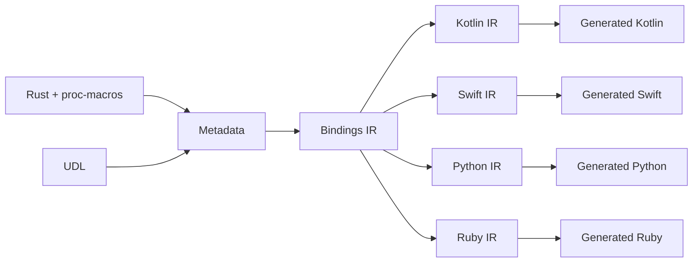

# Rendering Foreign Bindings

UniFFI models foreign bindings generation like a compiler pipeline:



- First, metadata is generated from the proc-macro code and UDL files.
  The metadata is a simple reflection of the Rust definitions.
- Then the metadata is transformed into an intermediate representation called the Bindings IR.
- Then, for each bindings language:
    - The Bindings IR is specialized for that language.
    - The language-specific IR is used to generate the bindings code.

## Proc-macro Metadata Generation

When a UniFFI proc-macro wraps a Rust item, it records metadata about the item it's wrapping.
For example, when `#[uniffi::export]` wraps a function, it records the function name, arguments, return type, etc.
This metadata is then serialized into a buffer and stored as an exported symbol in the Rust library.
The generated code will look something like this:

```rust
// Medata buffer for the `arithmetic::add()` function
const UNIFFI_META_CONST_ARITHMETIC_FUNC_ADD: ::uniffi::MetadataBuffer = ::uniffi::MetadataBuffer::from_code(
        ::uniffi::metadata::codes::FUNC, // Code for the item type
    )
    .concat_str("arithmetic") // module name
    .concat_str("add") // function name
    .concat_bool(false) // async?
    .concat_value(2u8) // number of arguments
    .concat_str("a") // 1st argument name
    .concat(<u64 as ::uniffi::TypeId<crate::UniFfiTag>>::TYPE_ID_META) // 1st argument type
    .concat_bool(false) // default value?
    .concat_str("b") // 2nd argument name
    .concat(<u64 as ::uniffi::TypeId<crate::UniFfiTag>>::TYPE_ID_META) // 2nd argument type
    .concat_bool(false) // default value?
    .concat(<Result<u64> as ::uniffi::TypeId<crate::UniFfiTag>>::TYPE_ID_META) // result type
    .concat_long_str(""); // docstring

// Serialize the metadata into a byte array and export the symbol.
//  This can be evaluated at compile time because `UNIFFI_META_ARITHMETIC_FUNC_ADD` is `const`.
#[no_mangle]
#[doc(hidden)]
pub static UNIFFI_META_ARITHMETIC_FUNC_ADD: [u8; UNIFFI_META_CONST_ARITHMETIC_FUNC_ADD
    .size] = UNIFFI_META_CONST_ARITHMETIC_FUNC_ADD.into_array();
```

Notes:

* UniFFI gets the type metadata types using the `TypeId::TYPE_ID_META`.
  By using a trait and associated type rather than relying on the type identifier, we get the correct metadata even through type aliases.
  For example, `Result<u64>` is a type alias with the error type omitted, but `<Result<u64> as ::uniffi::TypeId<crate::UniFfiTag>>::TYPE_ID_META>` includes metadata about the error type.
* See [Lifting and Lowering](./lifting_and_lowering.md) for details on `UniFfiTag`.

When a UniFFI bindgen command runs, it reads/deserializes the exported metadata symbols from the Rust library.
Then the metadata is passed on to the next stage of the pipeline
See `uniffi_bingen::macro_metadata` and `uniffi_meta::reader` for details.

Here's how the metadata might look for the above function:
```
FnMetadata {
    module_path: "arithmetic",
    name: "add",
    is_async: false,
    inputs: [
        FnParamMetadata {
            name: "a",
            ty: UInt64,
            by_ref: false,
            optional: false,
            default: None,
        },
        FnParamMetadata {
            name: "b",
            ty: UInt64,
            by_ref: false,
            optional: false,
            default: None,
        },
    ],
    return_type: Some(
        UInt64,
    ),
    throws: Some(
        Enum {
            module_path: "arithmetic",
            name: "ArithmeticError",
        },
    ),
    checksum: Some(
        39863,
    ),
    docstring: None,
},
```


## Metadata from the UDL file

UniFFI also generates metadata from UDL files and merges this with the proc-macro metadata.

## Metadata -> BindingsIr

This phase transforms the metadata into a `BindingsIr`, an intermediate representation of the generated bindings.
It adds derived information about the FFI, for example:

* The FFI scaffolding function for each Rust function
* The FFI scaffolding functions to clone/free object references
* The FFI type that each type is lowered into/lifted from
* If a type is used as an error or not

When the function metadata is transformed into the `BindingsIr`, [lowered FFI types and FFI scaffolding
function](./lifting_and_lowering.md) are added.

```
Function {
    name: "add",
    ...
    arguments: [
        Argument {
            name: "a",
            ty: Type {
                kind: UInt64,
                ffi_type: FfiType::UInt64,
                ...
            },
            ...
        },
        ...
    ],
    return_type: ReturnType {
        ty: Some(
            Type {
                kind: UInt64,
                ffi_type: FfiType::UInt64,
                ...
            },
        ),
        ...
    },
    throws_type: ThrowsType {
        ty: Some(
            Type {
                kind: Enum {
                    module_path: "arithmeticpm",
                    name: "ArithmeticError",
                },
                ffi_type: FfiType::RustBuffer,
                ...
            },
        ),
        ...
    },
    ffi_func: FfiFunctionRef {
        name: "uniffi_arithmeticpm_fn_func_add",
        ...
    },
    ...
}
```

## Specializing the BindingsIr

This phase transforms the general `BindingsIr` into a language-specific one.  Each bindings generate
defines it's own version of Bindings Ir types like `Record` and `Field`.  These types mostly mirror
the ones from the `ir` module, but there will be several differences:

* Language-specific data is added, like concrete type names and the names of the `FfiConverter` classes that lift/lower types
* New top-level items will be added to the language-specific `BindingsIr` struct, for example a list of import statements.
* Fields like `name` and `docstring` will transformed to the preferred style for the language.

For example, when the function IR is specialized for Python:

* Concrete type names will be added
* The FFI converter class name is added
* Docstrings will be formatted as Python docstrings
* For the most part names will stay the same, since Rust and Python happen to share a similar naming style.
  However, many other languages translate names into camelCase.

```
Function {
    name: "add",
    ...
    arguments: [
        Argument {
            name: "a",
            ty: Type {
                kind: UInt64,
                "type_name": String(
                    "int",
                ),
                "ffi_converter_name": String(
                    "_UniffiConverterUInt64",
                ),
                "ffi_type_name": String(
                    "ctypes.c_uint64",
                ),
                ...
            },
            ...
        },
        ...
    ],
    return_type: ReturnType {
        ty: Some(
            Type {
                kind: UInt64,
                "type_name": String(
                    "int",
                ),
                "ffi_converter_name": String(
                    "_UniffiConverterUInt64",
                ),
                "ffi_type_name": String(
                    "ctypes.c_uint64",
                ),
                ...
            },
        ),
        ...
    },
    throws_type: ThrowsType {
        ty: Some(
            Type {
                kind: Enum {
                    module_path: "arithmeticpm",
                    name: "ArithmeticError",
                },
                "type_name": String(
                    "ArithmeticError",
                ),
                "ffi_converter_name": String(
                    "_UniffiConverterTypeArithmeticError",
                ),
                "ffi_type_name": String(
                    "_UniffiRustBuffer",
                ),
                ...
            },
        ),
        ...
    },
    ffi_func: FfiFunctionRef {
        name: "uniffi_arithmeticpm_fn_func_add",
        ...
    },
    ...
},
```

## BindingsIr -> Generated Bindings Code

The final phase takes the specialized `BindingsIr` and uses it to generate the bindings code.
We use the [Rinja](https://rinja.readthedocs.io/en/stable/) template rendering engine for this.

In this phase, the top-level `add` function is implemented by:
  - checking/lowering all arguments using the class named by `Argument.ty.lang_data.ffi_converter_name`
  - calling the scaffolding function named by `ffi_func.name`
  - handling errors using the class named by `ReturnType.ty.lang_dataffi_converter_name`
  - lifting the return value using the class named by `ThrowsType.ty.lang_data.ffi_converter_name`

```python
def add(a: int, b: int) -> int:
    _UniffiConverterUInt64.check_lower(a)
    _UniffiConverterUInt64.check_lower(b)
    _uniffi_return = _uniffi_rust_call_with_error(
        _UniffiConverterTypeArithmeticError,
        _UniffiLib.uniffi_arithmeticpm_fn_func_add,
        _UniffiConverterUInt64.lower(a),
        _UniffiConverterUInt64.lower(b),
    )
    return _UniffiConverterUInt64.lift(_uniffi_return)
```

## Peeking behind the curtains with `peek` and `diff`

Use the `peek` subcommand from any UniFFI bindings generator to inspect this process.
`peek [phase]` will print out the data from any stage of the pipeline.
For example:
  * `uniffi-bindgen [bindgen-args] peek metadata` to inspect the metadata
  * `uniffi-bindgen [bindgen-args] peek bindings-ir` to inspect the `BindingsIr`
  * 
  * `uniffi-bindgen [bindgen-args] peek python-ir` to inspect the Python-specialized `BindingsIr`
  * `uniffi-bindgen [bindgen-args] peek kotlin` to inspect the Kotlin source
  * In general, use `[language-name]-ir` to see inspect the language-specific IR, and `[language-name]` to see the generated source.
  * `uniffi-bindgen-swift` also supports the `peek` subcommand

Use the `diff` subcommand to view changes in the bindings pipeline data

* `uniffi-bindgen [bindgen-args] diff-save` to store the current pipeline data for later diffing
* [make some changes to a UniFFIed library, or the UniFFI source itself]
* `uniffi-bindgen [bindgen-args] diff metadata` to see how those changes affected the metadata phase
* `uniffi-bindgen [bindgen-args] diff bindings-ir` to see how those changes affected the `BindingsIr`
* `uniffi-bindgen [bindgen-args] diff swift-ir` to see how those changes affected the Swift-specialized `BindingsIr`
* `uniffi-bindgen [bindgen-args] diff ruby` to see how those changes affected the generated Ruby code
